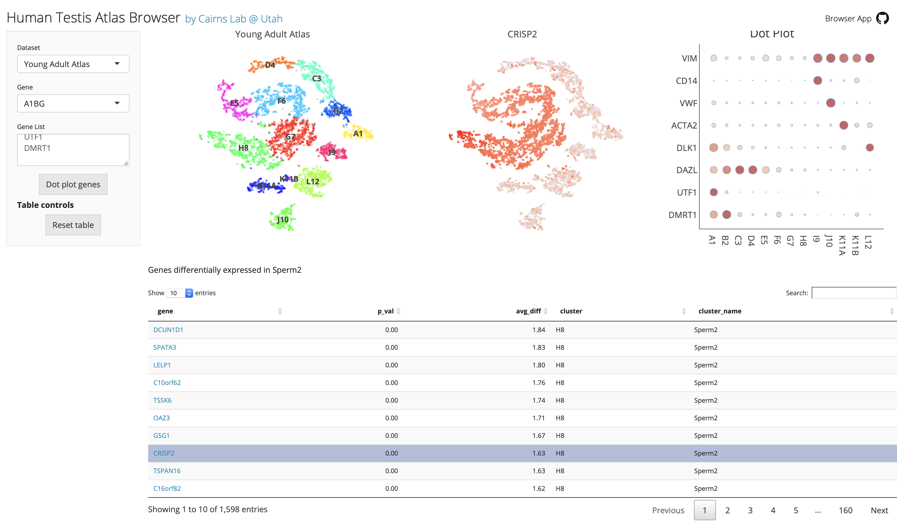

## Shiny Single Cell Browser

Interactive visualization of single cell RNAseq datasets. 

  - Visualize cluster distribution, marker gene expression levels. 
  - Select or click on a gene to show its expression on t-SNE/UMAP plots, select a cluster to show its marker genes.
  - Specify pre-analyzed datasets ([Seurat v2 or v3](https://github.com/satijalab/seurat) format) in the JSON config file. 

 
  

Published data using this web app:
  - [Human Organoid Single-Cell Browser](https://shcheglovitov.shinyapps.io/u_brain_browser/) -- Y Wang, et al. [Modeling autism-associated SHANK3 deficiency using human cortico-striatal organoids generated from single neural rosettes](https://www.biorxiv.org/content/10.1101/2021.01.25.428022v1), bioRxiv, 2021
  - [Human Testis Atlas Browser](https://humantestisatlas.shinyapps.io/humantestisatlas1/) -- J Guo, et al. [The Dynamic Transcriptional Cell Atlas of Testis Development during Human Puberty](https://www.sciencedirect.com/science/article/pii/S1934590919305235), Cell Stem Cell, 2020

## Setting up the Single Cell Browser
  
  - Download the source code -- `git clone https://github.com/yueqiw/shiny_cell_browser.git`.
  - Install package dependencies listed in [requirements.txt](requirements.txt).
    - The app has been tested in R version 3.6.3.
    - Seurat v2.3.4 and v3.1.0 are supported. These versions can be installed following the official [instructions](https://satijalab.org/seurat/articles/install.html).
  - Prepare Seurat data
    - Analyze the dataset following Seurat v2 or v3 [pipeline](https://satijalab.org/seurat/articles/get_started.html) (clustering, t-SNE/UMAP, differential expression, etc). Alternatively, create a Seurat object by [converting](https://satijalab.org/seurat/articles/conversion_vignette.html) from other formats.
    - Store the Seurat v2 or v3 data object as a `.rds` file using [`saveRDS()`](https://www.rdocumentation.org/packages/base/versions/3.6.2/topics/readRDS). Place the `.rds` file in the [`data/`](data/) folder.
    - The Seurat data object (or the RNA assay in Seurat3) should fill the `@data` slot with the normalized and log-transformed gene expression matrix (ideally in a sparse `dgCMatrix` format to save space). The `@raw.data` and `@scale.data` slots are not used -- setting them to `NULL` may speed up the loading time.
    - The Seurat object should contain a 2D cell embedding created using t-SNE or UMAP.
    - The `@meta.data` table should use cell names as row names and contain a column that indicates the cluster id for each cell. Optionally, the display color of each cluster  can be stored as a named vector in `@misc`. For examples, if the clusters are stored as `seurat_data@meta.data$my_clusters`, their colors can be stored as `seurat_data@misc$my_clusters_colors`.
    - Store the marker gene differential expression table in a `.csv` file in the [`data/`](data/) folder. The table must contain two columns named `gene` and `cluster`. Other columns may have any name.
  - Specify the visualization config and data file paths by creating a `data/config.json` file and following the example in [`data/example_config.json`](data/example_config.json). 
    - Multiple datasets can be configured in the same browser.
    - The browser-level config includes the browser title and url link
    - The dataset-level config options are listed below:
      - `name`: the dataset name.
      - `file`: the `.rds` file path.
      - `cluster`: the name of the column containing the displayed cluster ids.
      - `embedding`: the type of 2D embedding (e.g. tsne or umap).
      - `diff_ex_cluster`: the name of the `@meta.data` cluster id column that corresponds to the cluster ids in the differential expression `csv` file. In most cases, this is the same as `cluster`.
      - `diff_ex_file`: the marker gene differential expression `csv` file.
      - `cluster_name_mapping` (optional): a mapping from the Seurat cluster ids to more readable cluster names.
      - `pt_size` (optional): if set, overrides the automatically computed point size in embedding plots.
      - `font_scale` (optional): if set, scales the font size of cluster labels by this factor.
      - `label_coordinates` (optional): if set, the cluster labels will be placed at these coordinates rather than at the center of each cluster.

## Launching the Single Cell Browser locally
  - Set the working directory (e.g. `cd shiny_cell_browser` in command line, or `setwd` in Rstudio)
  - Launch the Single Cell Browser locally. Run `./run_app.sh` in the comand line, or `shiny::runApp()` in Rstudio.  
  - This should launch the browser on the local computer at `http://127.0.0.1:4894/`. The port number can be changed (e.g. `shiny::runApp(port=1234)`). 
  - For other computers in the local network to access the web app, specify `host='0.0.0.0', port=1234` in the `runApp` call, then visit `http://your-ip-address:1234`.
  
## Deploy the Single Cell Browser
  - The App can be easily deployed on a web server using [shinyapps.io](https://www.shinyapps.io), which supports both free and paid servers. Docker is an alternative approach but takes longer to set up.
  - To set up a [shinyapps.io](https://www.shinyapps.io) account and learn how to deploy a Shiny app, follow this [tutorial](https://shiny.rstudio.com/articles/shinyapps.html).
  - After setting up the account, deploy the app by [`rsconnect::deployApp()`](https://www.rdocumentation.org/packages/rsconnect/versions/0.8.18/topics/deployApp).

If you encounter the following error: `Error parsing manifest: Unable to determine package source for Bioconductor package Biobase: Repository must be specified`, run this before deployApp: `options(repos = BiocManager::repositories()`

  
## Updates

see [updates.md](UPDATES.md)

